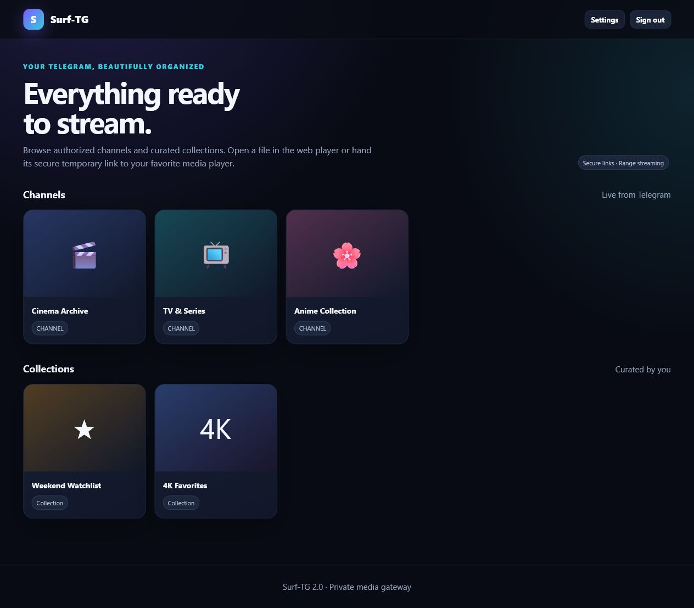

# Surf-TG 2.0

A small, self-hosted gateway for browsing and streaming media from **Telegram channels you are authorized to access**.



Surf-TG keeps the original project's direct, uncomplicated workflow: sign in, open a channel, choose a file, and play it. Version 2 rebuilds the unsafe parts, fixes byte-range edge cases, and ships a responsive interface without remotely hosted JavaScript.

## Highlights

- Private channel and collection browser
- HTTP range streaming with correct single-byte, suffix, open-ended, and chunk-boundary handling
- Signed, expiring stream links for VLC, MX Player, browser playback, and downloads
- Multiple Telegram bot clients with least-loaded selection
- Search, pagination, thumbnails, and curated folders
- Viewer and administrator roles
- PBKDF2-SHA256 password hashes and encrypted, persistent cookies
- Authorized-channel enforcement for browsing and thumbnails
- Optional allowlist for Telegram `/start file_...` shortcuts
- Responsive, self-contained UI
- Docker deployment and automated regression tests

## Security changes from Surf-TG 1.x

| Previous behaviour | Surf-TG 2.0 |
|---|---|
| Six-character Telegram unique ID used as a secret | HMAC-SHA256 signed stream capability with expiry |
| Direct stream endpoint accepted arbitrary chat/message coordinates | Coordinates must match a valid signed capability |
| `/send` import endpoint was public | Administrator session, authorized channel, and token validation required |
| Thumbnail/channel routes accepted arbitrary chats | Restricted to configured authorized channels |
| Session encryption key changed after every restart | Stable key derived from deployment `SECRET_KEY` |
| Default `admin/admin` credentials | Startup refuses known default credentials |
| Plain-text passwords only | PBKDF2-SHA256 hashes supported and recommended |
| Unlimited login attempts | Per-address login throttling |
| Message cache keyed only by message ID | Cache keyed by `(chat_id, message_id)` |
| Incorrect inclusive range chunk count | Tested inclusive range planner |
| Blocking MongoDB operations in the event loop | Database calls moved to worker threads |
| Source deleted and replaced from Git on every boot | Self-updater removed completely |
| Remote scripts and developer-tool blocker | Local CSS/JavaScript only |
| Root Docker process with Git in runtime | Minimal non-root runtime image |

## Requirements

- Python 3.11 or 3.12, or Docker
- A MongoDB instance
- Telegram API ID and API hash from `my.telegram.org`
- A Telegram bot that can read each configured channel
- Optional Pyrogram/Pyrofork user session for history browsing

Only use Surf-TG with media and channels you have permission to access. Telegram is not a substitute for appropriate content rights.

## Configuration

Copy `config_sample.env` to `config.env` and fill in the required values.

Generate a deployment secret:

```bash
python -c "import secrets; print(secrets.token_urlsafe(48))"
```

Generate viewer and administrator password hashes:

```bash
python -m bot.helper.security
```

Store the resulting strings as `PASSWORD_HASH` and `ADMIN_PASSWORD_HASH`. The plain-text `VIEWER_PASSWORD` and `ADMIN_PASSWORD` variables exist only for migration and should be removed after hashes are configured.

Important settings:

| Variable | Purpose |
|---|---|
| `AUTH_CHANNEL` | Comma-separated channel IDs such as `-1001234567890` |
| `SECRET_KEY` | At least 32 random characters; changing it signs users out and invalidates links |
| `STREAM_TOKEN_TTL` | Link lifetime in seconds; default is six hours |
| `COOKIE_SECURE` | Keep `true` behind HTTPS; use `false` only for local HTTP development |
| `ALLOWED_TELEGRAM_USERS` | Telegram numeric user IDs allowed to request files through bot deep links |
| `MULTI_TOKEN1...50` | Optional extra bot tokens used for streaming capacity |

## Run with Docker

```bash
cp config_sample.env config.env
# Edit config.env first
docker compose up --build
```

Open `http://localhost:8080`. When testing locally over HTTP, set `COOKIE_SECURE=false`. Production deployments should terminate HTTPS at a trusted reverse proxy and keep it enabled.

## Run from Python

```bash
python -m venv .venv
. .venv/bin/activate
pip install -r requirements.txt
python -m bot
```

On Windows, activate with `.venv\Scripts\activate`.

## Initial channel indexing

1. Add the bot to every channel in `AUTH_CHANNEL`.
2. Send `/index` in a configured channel once to import existing messages.
3. New document and video messages are indexed automatically.
4. Add a `SESSION_STRING` if you want the UI to browse Telegram history directly instead of relying only on MongoDB's index.

## Tests

```bash
python -m unittest discover -s tests -v
python -m compileall -q bot tests
```

The regression suite covers password hashes, signed-link tampering and expiry, RFC-style range parsing, the one-byte range case, exact 1 MiB boundaries, and external-script checks.

## Architecture

```text
Browser / player
       │ authenticated pages + signed temporary stream links
       ▼
aiohttp web gateway
       ├── MongoDB: index, collections, settings
       └── Pyrofork clients
               └── Telegram channels
```

This is intentionally a focused file gateway. Rich movie/series metadata and Stremio catalogs belong in the planned next-generation service rather than this small server.

## Compatibility note

Old `?hash=abcdef` stream and watch links are intentionally invalid. Open the file from the upgraded library to obtain a new signed link.

## License and attribution

GPL-3.0. This project is derived from [weebzone/Surf-TG](https://github.com/weebzone/Surf-TG); the original copyright and license are preserved in `LICENSE`.
